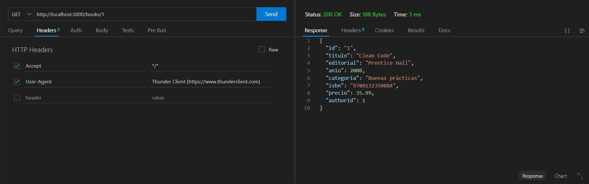
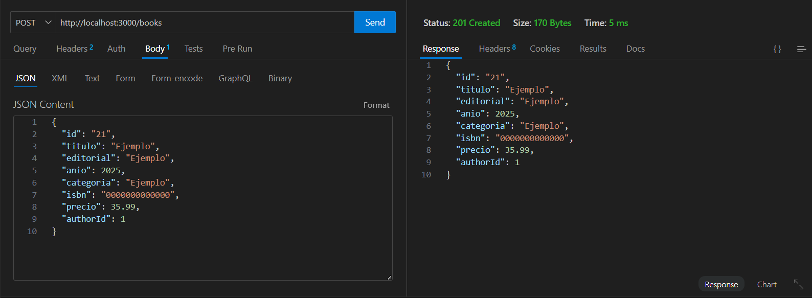
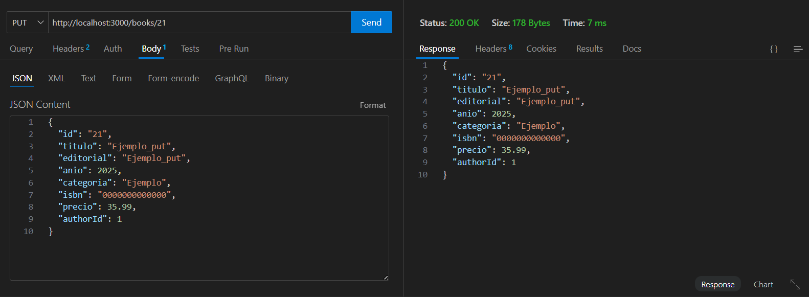
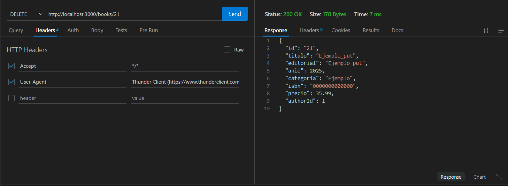
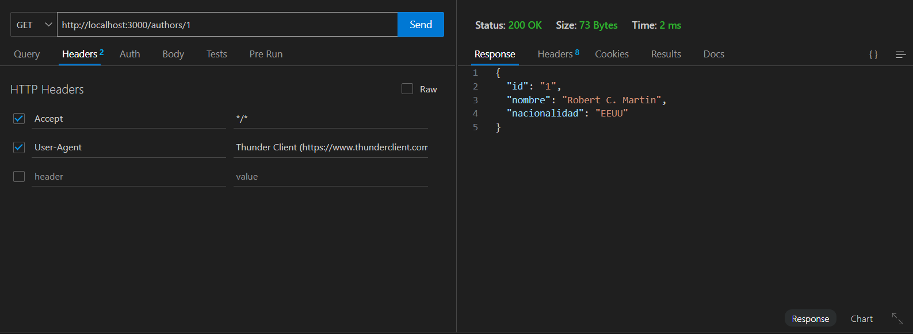
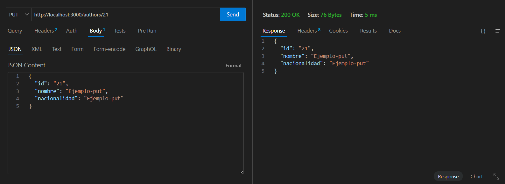
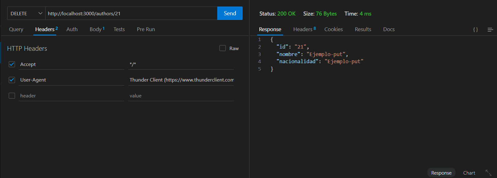

# Checklist CRUD Libros y Autores

## Thunder Client
- [x] Realizar petición **GET** para listar libros

- [x] Realizar petición **POST** para crear un libro

- [x] Realizar petición **PUT** para actualizar un libro

- [x] Realizar petición **DELETE** para eliminar un libro

- [x] Realizar petición **GET** para listar autores

- [x] Realizar petición **POST** para crear un autor

- [x] Realizar petición **PUT** para actualizar un autor

- [x] Realizar petición **DELETE** para eliminar un autor

- [x] Adjuntar capturas de pantalla de cada operación

## Script peticiones_http.sh
- [x] Crear script `peticiones_http.sh` en la carpeta `scripts`
- [x] Realizar petición **GET** para listar libros usando `curl`
- [x] Realizar petición **POST** para crear un libro usando `curl`
- [x] Realizar petición **PUT** para actualizar un libro usando `curl`
- [x] Realizar petición **DELETE** para eliminar un libro usando `curl`
- [x] Realizar petición **GET** para listar autores usando `curl`
- [x] Realizar petición **POST** para crear un autor usando `curl`
- [x] Realizar petición **PUT** para actualizar un autor usando `curl`
- [x] Realizar petición **DELETE** para eliminar un autor usando `curl`