# CRUD DOCUMENTATION

Documentación para explicar cómo realizar las operaciones **CRUD**

---

## Configuración Principal

Lo primero que hay que hacer, son las importaciones. En este caso solamente tenemos que hacer la importación del "dotenv" para poder cargar variables de entorno desde un archivo .env

>import dotenv from "dotenv";


Las variables de entorno definen la URL base:

```bash
API_BASE_URL=http://localhost
PORT=3000
```

Por lo tanto, la URL base será:

```
BASE_URL=http://localhost:3000
```

---
## CREATE

Con el CREATE tenemos que crear un nuevo estudiante en la base de datos y para eso tenemos que hacer lo siguiente:

### URL

Lo primero que hacemos, es crear la URL para los estudiantes:
>const url = BASE_URL + "/students";

### Comando `curl`

Después de crear la URL, ahora prosigue el comando CURL y este lo preparamos con los datos en JSON

```bash
curl -i -X POST "http://localhost:3000/students" -H "Content-Type: application/json" -d '{ "nombre": "Antonio", "edad": 43 }'
```
### Explicación

- `-i`: muestra headers + body de la respuesta. 
- `-X POST`:  Indica el método HTTP **POST** 
- `-H "Content-Type: application/json"`:  Especifica que el cuerpo es JSON 
- `-d '{ ... }'`:  Envía los datos en formato JSON 

### Resultado

Si te ha salido bien el comando, se tendria que ver algo así como lo siguiente:

**Código:** `201 Created`  
**Body:**
```json
{
  "id": 1,
  "nombre": "Antonio",
  "edad": 43
}
```
---
## READ ALL

Con el READ ALL, tenemos que leer todos los estudiantes de la base de datos para tener una lista con todos los estudiantes y para eso tenemos que hacer lo siguiente:

### URL

Lo primero que hacemos, es crear la URL para leer todos los estudiantes:
>const url = BASE_URL + "/students";

### Comando `curl`

Después de crear la URL, tenemos que hacer el comando CURL a través de una petición GET y para poder hacer eso, necesitamos colocar dentro del comando una cadena de carácteres y usar una variable que tenga la dirección del recurso que se quiere usar

```bash
const curl = 'curl -i -X GET "'+url+'"'
```

### Explicación

- `-X GET`:  método para obtener datos. 
- No lleva `-d` porque no se envían datos. 

### Resultado

Si te ha salido bien el comando, se tendria que ver algo así como lo siguiente:

**Código:** `200 OK`  
**Body:**
```json
[
  { "id": 1, "nombre": "Antonio", "edad": 43 },
  { "id": 2, "nombre": "María", "edad": 25 }
]
```
---
## READ BY ID

Con el READ BY ID, tenemos que leer un estudiante por su ID y para eso tenemos que hacer lo siguiente:

### URL

Lo primero que hacemos, es crear la URL para leer los estudiantes por su ID y para que sea así, tenemos que agregar "**+id**" al después de "**students/**":
>const url = BASE_URL+"/students/"+id;

### Comando `curl`

Después de crear la URL, tenemos que hacer el comando CURL a través de una petición GET y para poder hacer eso, necesitamos colocar dentro del comando una cadena de carácteres y usar una variable que tenga la dirección del recurso que se quiere usar

```bash
const curl = 'curl -i -X GET "'+url+'"'
```

### Explicación

- `-X GET`:  método para obtener datos. 
- No lleva `-d` porque no se envían datos.

### Resultado

Si te ha salido bien el comando, se tendria que ver algo así como lo siguiente:

**Código:** `200 OK`  
**Body:**
```json
{
  "id": 1,
  "nombre": "Antonio",
  "edad": 43
}
```
**Si el ID no existe:**

**Código:** `404 Not Found`  
**Body:**
```json
{ "error": "Estudiante no encontrado" }
```

---
## UPDATE (PUT)

Con el UPDATE (PUT), tenemos que actualizar los datos de un estudiante por su ID y para eso tenemos que hacer lo siguiente:

### URL

Lo primero que hacemos, es crear la URL para actualizar los datos de un estudiante por su ID y para que sea así, tenemos que agregar "**+id**" al después de "**students/**":
>const url = BASE_URL + "/students";

### Comando `curl`

Después de crear la URL, ahora prosigue el comando CURL y este lo preparamos con los datos en JSON para poder actualizar los datos del estudiante

```bash
// Preparamos los datos en JSON en la variable data para mandar los campos actualizados
const data = '{ "nombre": "'+studentData.nombre+'", "edad": '+studentData.edad + ' }';

// comando curl con PUT para que se actualicen los datos
const curl = 'curl -i -X PUT "' + url + '" -H "Content-Type: application/json" -d \'' + data+ '\'';
```

### Explicación

- `-i`: muestra headers + body de la respuesta. 
- `-X PUT`: método para actualizar datos

### Resultado

Si te ha salido bien el comando, se tendria que ver algo así como lo siguiente:

**Código:** `200 OK`  
**Body:**
```json
{
  "id": 1,
  "nombre": "Antonio Lovato",
  "edad": 45
}
```

**Si el ID no existe:**
**Código:** `404 Not Found`

---

## PATCH

Con el PATCH, tenemos que actualizar algunos campos de los datos de un estudiante por su ID y para eso tenemos que hacer lo siguiente:

### URL

Lo primero que hacemos, es crear la URL para actualizar los datos de un estudiante por su ID y para que sea así, tenemos que agregar "**+id**" al después de "**students/**":
>const url = BASE_URL + "/students";

### Comando `curl`

Después de crear la URL, ahora prosigue el comando CURL y este lo preparamos con los datos en JSON para poder actualizar algunos de los datos del estudiante

```bash
// Preparamos los datos en JSON para mandar los campos actualizados
const data = '{ "edad": '+partialData.edad+' }';

// comando curl con PATCH para actualizar los datos parcialmente
const curl = 'curl -i -X PATCH "'+url+'" -H "Content-Type: application/json" -d \''+data+'\'';
```

### Explicación

- `-i`: muestra headers + body de la respuesta. 
- `-X PATCH`: método para actualizar datos de campos específicos.

### Resultado

Si te ha salido bien el comando, se tendria que ver algo así como lo siguiente:

**Código:** `200 OK`  
**Body:**
```json
{
  "id": 1,
  "nombre": "Antonio Lovato",
  "edad": 49
}
```

---

## DELETE

Con el DELETE, tenemos que eliminar un estudiante por su ID y para eso tenemos que hacer lo siguiente:

### URL

Lo primero que hacemos, es crear la URL para eliminar los datos de un estudiante por su ID y para que sea así, tenemos que agregar "**+id**" al después de "**students/**":

### Comando `curl`

Después de crear la URL, tenemos que hacer el comando CURL a través de DELETE y para eliminar ese estudiante, necesitamos colocar dentro del comando una cadena de carácteres y usar una variable que tenga la dirección del recurso que se quiere usar

```bash
const curl = 'curl -i -X DELETE "'+url+'"';
```

### Explicación

- `-X DELETE`:  método para eliminar datos.

### Resultado

**Código:** `204 No Content`  
(Sin cuerpo)

**Si el ID no existe:**

**Código:** `404 Not Found`  
**Body:**
```json
{ "error": "Estudiante no encontrado" }
```
---

## Pruebas Reales con json-server 

1. Levantar servidor:
```bash
npm run server:up
```
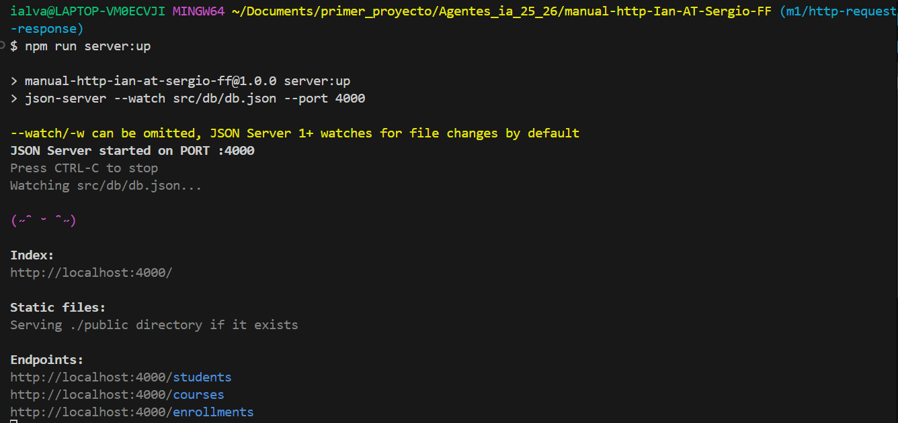

2. Ejecutar cada comando cURL de las operaciones anteriores.
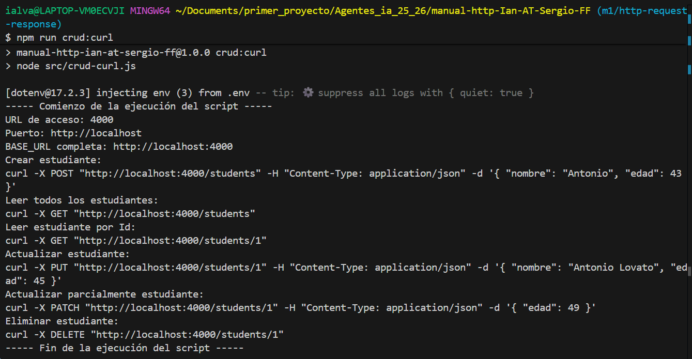

3. Capturar **respuesta completa** (headers + body) usando `-i`.

### CREATE Student

#### 📥 Headers enviados  
- `Content-Type: application/json` → necesario para que `json-server` interprete correctamente el body. 

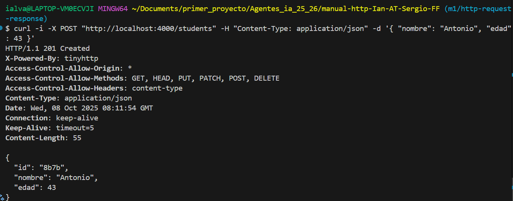

#### Código de estado
- **201 Created**: recurso creado correctamente.
---
### GET All Students

#### 📥 Headers enviados  
- Ninguno adicional, solo la petición básica.  

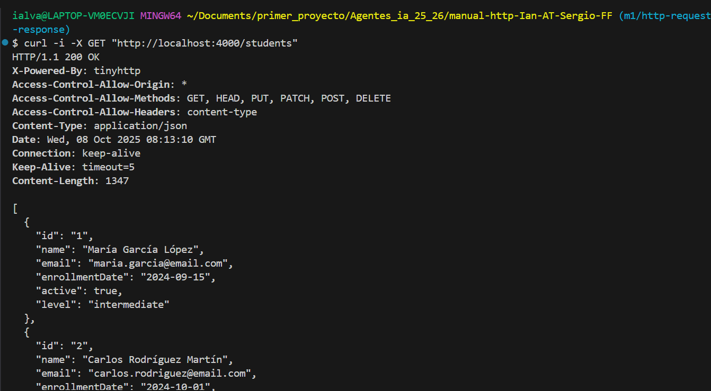
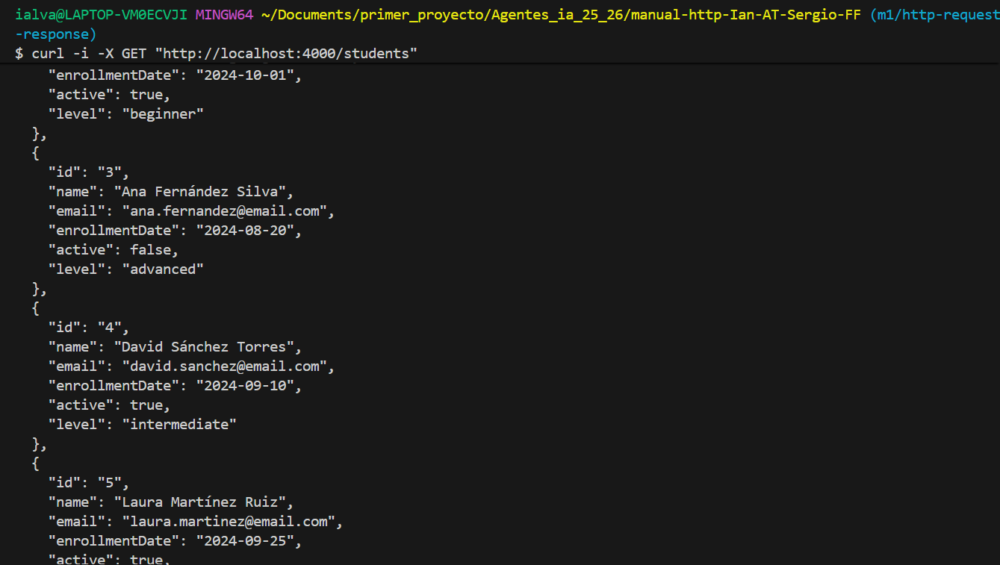
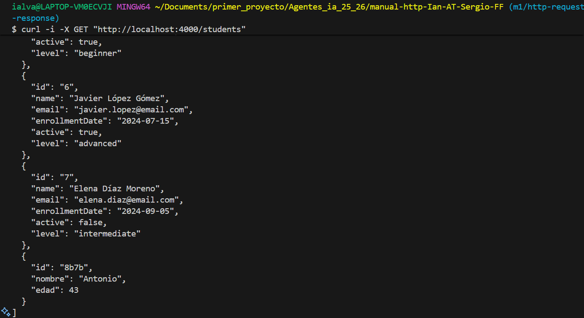

#### Código de estado
- **200 OK**: petición exitosa.
---
### GET Student by ID

#### 📥 Headers enviados  
- Ninguno adicional, solo la petición básica.  


#### Código de estado
- **200 OK**: petición exitosa.
---
### UPDATE Student

#### 📥 Headers enviados
`Content-Type: application/json` → porque se envía un body en `JSON` con todos los datos del estudiante.

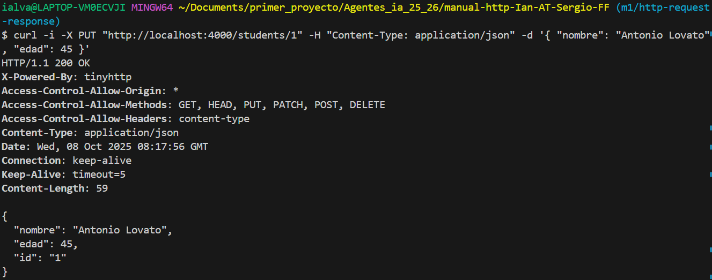

#### Código de estado
- **200 OK**: petición exitosa.
---

### PATCH Student

#### 📥 Headers enviados
`Content-Type: application/json` → porque se envía un body en `JSON` con los campos parciales a actualizar.

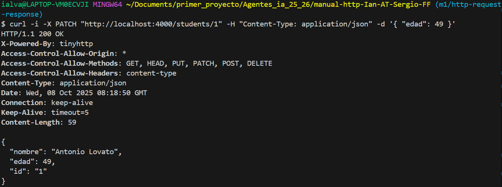

#### Código de estado
- **200 OK**: petición exitosa.
---

### DELETE Student

#### 📥 Headers enviados  
- Ninguno adicional, solo la petición básica. 


#### Código de estado
- **200 OK**: petición exitosa.
---

## Explicación de las Flags de `curl`

| Flag | Descripción |
|------|--------------|
| `-i` | Muestra **headers** y **body** de la respuesta |
| `-X` | Especifica el método HTTP (**GET**, **POST**, **PUT**, etc.) |
| `-H` | Añade encabezados a la petición |
| `-d` | Envía datos en el cuerpo de la petición (solo para **POST**, **PUT**, **PATCH**) |

---

## Códigos del Estado HTTP

| Código | Significado | Uso |
|--------|--------------|-----|
| `200 OK` | Petición exitosa | GET, PUT, PATCH |
| `201 Created` | Recurso creado correctamente | POST |
| `204 No Content` | Eliminación exitosa, sin cuerpo | DELETE |
| `400 Bad Request` | Datos enviados no válidos | POST, PUT, PATCH |
| `404 Not Found` | Recurso no encontrado | GET, PUT, PATCH, DELETE |
| `500 Internal Server Error` | Error en el servidor | General |

---

# Thunder Client Documentation

1. Abre **Thunder Client** en Visual Studio Code.
2. Introduce la URL base de la API
3. Selecciona el metodo que vas a usar (**GET**, **POST**, **PUT**, **PATCH**, **DELETE**)
4. Pon las cabeceras que necesites segun la documentacion de la API. Por ejemplo
```json
{"Content-Type": "application/json"}

```
5. En metodos como **PUT**, **PATCH** o **POST**; añade al body lo que quieres hacer 
6. Envia la petición y comprueba que te devuelve

## Capturas de pantalla

### ➕ CREATE Student
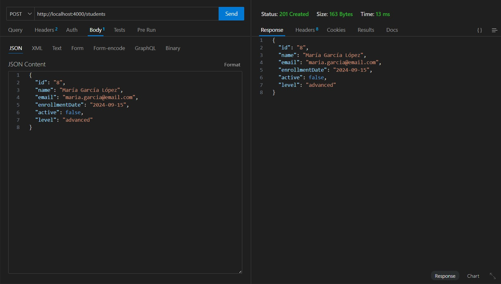

### 📋 GET All Students


### 🔍 GET Student by ID
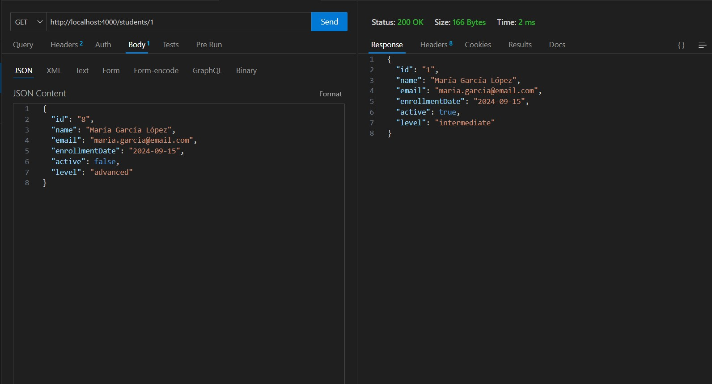

### 🔄 UPDATE Student


### ✏ PATCH Student
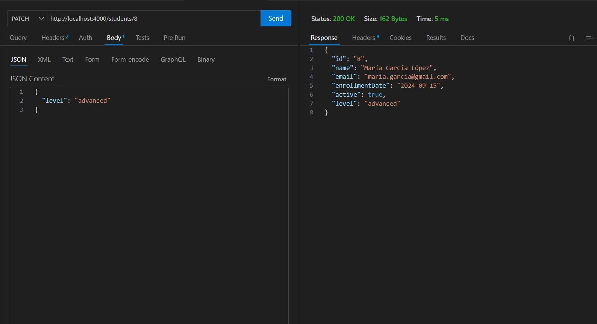

### 🗑 DELETE Student
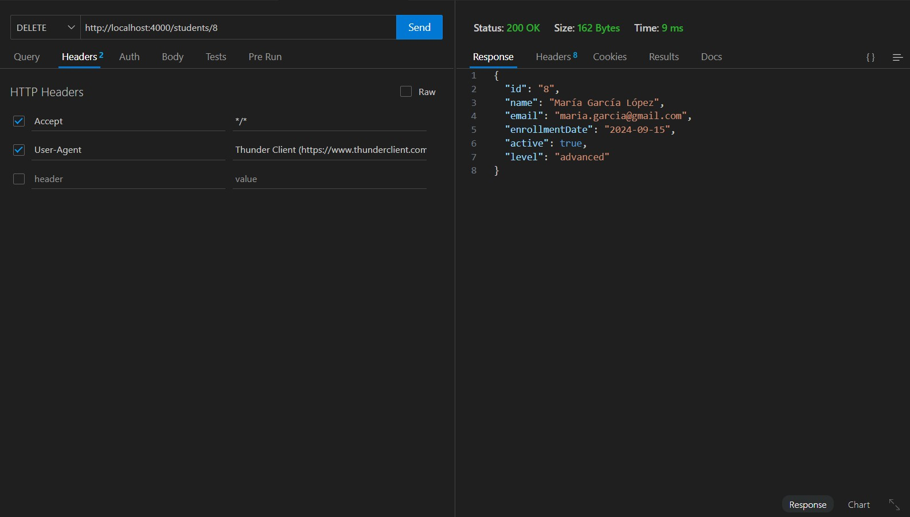
